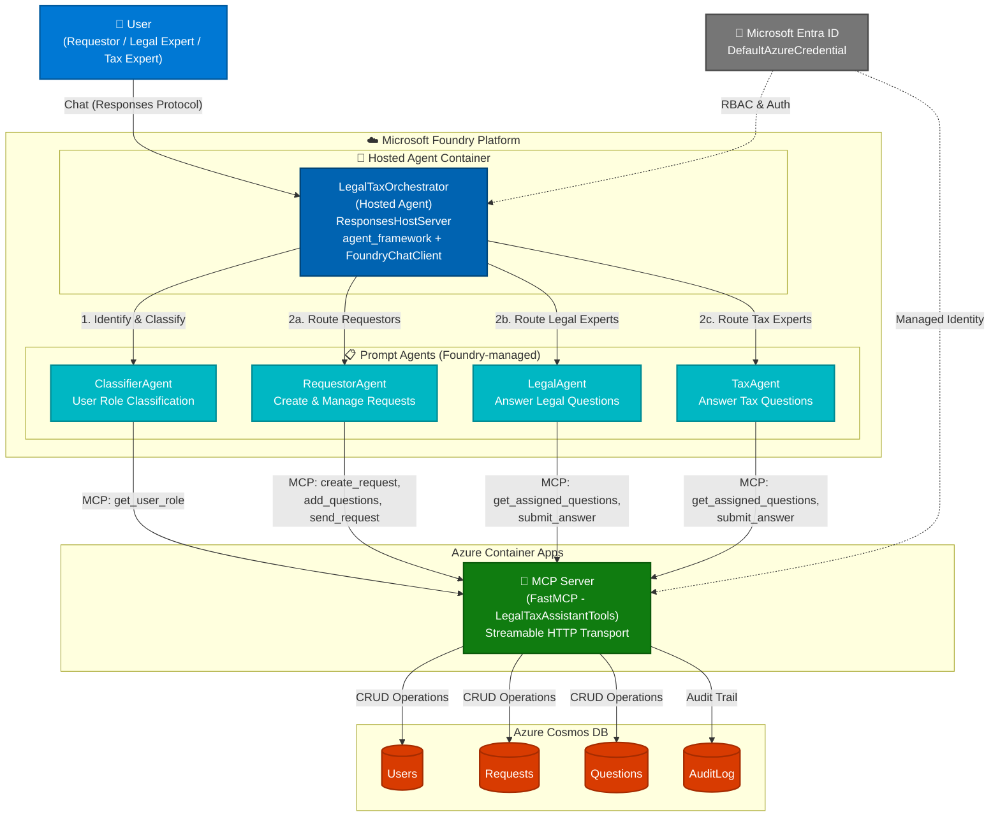

# Legal & Tax Assistant - Solution Architecture

## Overview

The Legal & Tax Assistant is a multi-agent AI system deployed on **Microsoft Foundry** that helps organizations manage legal and tax question workflows. It uses a hosted agent orchestrator pattern with specialized prompt agents connected to MCP servers for data operations.

## Architecture Diagram

## Component Details

| Component | Type | Description |
|-----------|------|-------------|
| **LegalTaxOrchestrator** | Hosted Agent (Container) | Python-based orchestrator using Microsoft Agent Framework + FoundryChatClient. Routes users to specialist agents based on role. |
| **ClassifierAgent** | Prompt Agent | Identifies user role (Requestor/LegalExpert/TaxExpert) via MCP tool lookup. |
| **RequestorAgent** | Prompt Agent | Handles request creation, question categorization, and submission workflows. |
| **LegalAgent** | Prompt Agent | Enables legal experts to view assigned questions and submit answers. |
| **TaxAgent** | Prompt Agent | Enables tax experts to view assigned questions and submit answers. |
| **MCP Server** | Azure Container App | FastMCP server exposing CRUD tools over Streamable HTTP transport. |
| **Azure Cosmos DB** | NoSQL Database | Stores Users, Requests, Questions, and AuditLog collections. |
| **Microsoft Entra ID** | Identity Provider | Provides RBAC and managed identity authentication. |

## Data Flow

1. **User** sends a chat message via the Responses Protocol
2. **Orchestrator** identifies the user (via WorkIQ Toolbox) and classifies their role using ClassifierAgent
3. Based on role, the message is routed to the appropriate specialist agent
4. Specialist agents call **MCP tools** to perform operations (create requests, assign questions, submit answers)
5. MCP Server performs **CRUD operations** on Azure Cosmos DB
6. All operations are logged in the **AuditLog** collection
